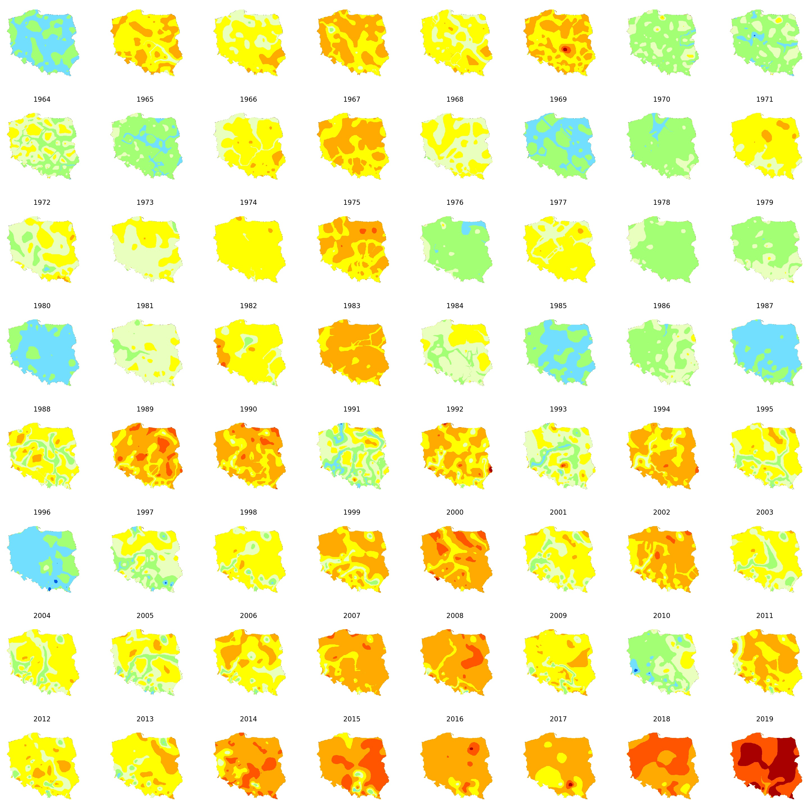

# Climate change visualisation

Data (IMGW) processing and export to SHP made in Pandas and Geopandas [link](https://github.com/marcinszwagrzyk/Climate_analysis/blob/master/Poland_climate_change_monthly.ipynb)

Geovisualistaions and grid of maps made with Arcpy and Matplotlib [link](https://github.com/marcinszwagrzyk/Climate_analysis/blob/master/map_plotting.py)




Maps show the anomaly of mean temperature for each year for meteostations in Poland,
compared to the average over the reference period  1960–1990

Data downlaoded from IMGW: https://danepubliczne.imgw.pl/


Get the dataset from [here](https://github.com/Avik-Jain/100-Days-Of-ML-Code/blob/master/datasets/Social_Network_Ads.csv)
```python
dataset = pd.read_csv('Social_Network_Ads.csv')
X = dataset.iloc[:, [2, 3]].values
y = dataset.iloc[:, 4].values
```
